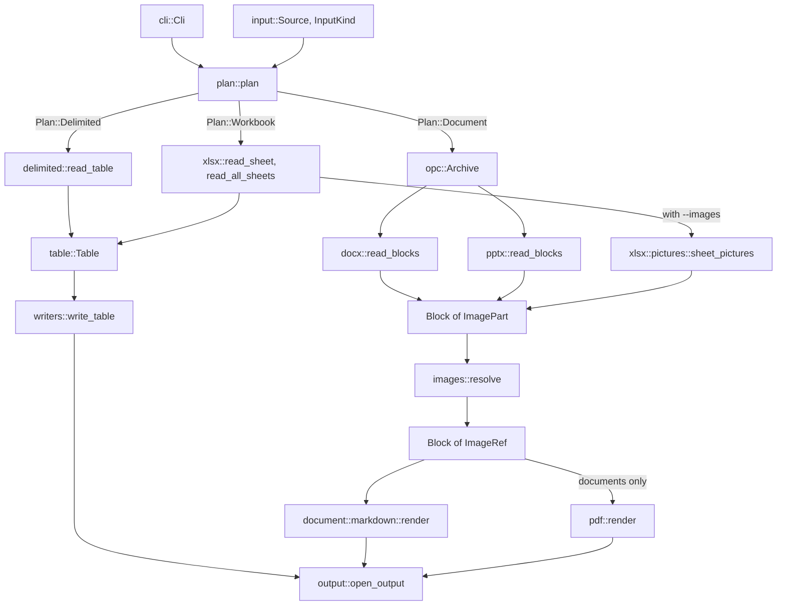

# Architecture

How a conversion moves through the code, from the command line to the file it writes. This is
the map; the details live elsewhere:

- [AGENTS.md](AGENTS.md): the rules a change has to follow.
- [CONTRIBUTING.md](CONTRIBUTING.md): building, testing and fuzzing, and the
  [layout](CONTRIBUTING.md#layout) of every top-level file and directory.
- [docs/adr/](docs/adr/README.md): why the design is the way it is.
- [SECURITY.md](SECURITY.md): what officeconv protects against, and which code does it.
- [docs/formats.md](docs/formats.md): what each input keeps and each output shows.
- Each module's doc comment: `cargo doc --document-private-items --open`.

## The pipeline

Every conversion is one pass: choose a plan, read the input into a model, deal with its images,
and write the model out.

There are two models, and the paths only meet at images. A spreadsheet or a CSV file becomes a
`table::Table`; a Word document or a deck becomes a list of `document::Block`s. A sheet's
pictures are the one crossing: they're read as blocks, so they go through the same image
handling as a document's, and their Markdown is written under the sheet's table.

## Choosing a plan

`run()` in `src/lib.rs` decides nothing itself. It works out the input, asks `plan` what to do,
and calls the function for that `Plan`.

- **`cli`** defines the options with clap.
- **`input`** opens the input. `Source` is a file or all of stdin, read into memory because a
  zip archive needs to seek. `Source::kind` picks the `InputKind`: `--from` if given, then a
  known extension, then the parts inside the archive. CSV and TSV have nothing inside to
  recognize, so on stdin they need `--from`.
- **`plan`** holds every rule about which inputs, outputs and options go together. One table,
  `target()`, says which input converts to which output, and both `plan()` and the error
  messages read it. `check_options()` runs before the input is read, so a mistake in the
  options is reported without waiting for a slow pipe.

A `Plan` is one of three:

| Plan | Input | Model | Outputs |
| --- | --- | --- | --- |
| `Plan::Delimited` | `.csv`, `.tsv` | `Table` | CSV, TSV, JSON, Markdown |
| `Plan::Workbook` | `.xlsx` | `Table` per sheet, plus pictures | CSV, TSV, JSON, Markdown |
| `Plan::Document` | `.docx`, `.pptx` | `Block`s | Markdown, PDF |

## Reading

### Office packages

`.docx`, `.pptx` and `.xlsx` files are zip archives of XML parts, which refer to each other
through relationship parts (`word/_rels/document.xml.rels`). `src/opc.rs` has what all three
readers share:

- **`Archive`** reads parts and counts every byte it decompresses against `Limits`, so a zip
  bomb fails on the bytes actually read, whatever its headers claim. Every part a reader uses,
  images included, comes through it.
- **`Archive::relationships` and `Targets`** turn a part's relationship IDs into links and image
  parts. Links are filtered here, by `is_safe_link`, so a reader never sees a `javascript:` URL.
- **`walk()`** streams through one part's XML and calls an `XmlHandler` for each tag and piece
  of text, never building a tree. With each call comes `Open`, the stack of elements open around
  it. A reader decides what something means from where it is ("text inside `t` inside `r`")
  instead of keeping a flag per element. `XmlHandler::SKIP` names elements whose contents are
  ignored, such as `Fallback`, the second copy of content stored twice.

### Documents

`docx::read_blocks` and `pptx::read_blocks` each run a parser over their parts with `walk()`,
and the parser builds blocks through `document::builder::BlockBuilder`. The reader decides what
an element means; the builder owns what's open (the paragraph, the table and its cells, the
current run's formatting and link) and where finished content goes.

- **DOCX** reads `word/document.xml` with its supporting parts: numbering, styles, and footnotes
  and endnotes, which are numbered in the order the body refers to them and added after it. The
  first section's header and footer come before the body, as `Block::Header` and
  `Block::Footer`, for PDF to repeat on each page.
- **PPTX** reads the slides in the order `ppt/presentation.xml` lists them, and each slide's
  notes unless `--no-notes` (`pptx::Notes`) leaves them out. Each slide becomes a heading, its
  text and its notes, with a rule between slides.

### Spreadsheets

- **XLSX** cell values are read by [calamine](https://crates.io/crates/calamine), which has no
  size limits of its own. So `xlsx::check_sizes` first decompresses every part through
  `Archive` to check it's within `Limits`, then hands the file to calamine. Cells keep their
  type as `table::Cell`, for `--typed` JSON. With `--images`, the archive is opened once more to
  find each sheet's drawings (`xlsx::pictures`), and stays open in `xlsx::Workbook` for the
  images to be read from.
- **CSV and TSV** are read by `delimited::read_table`, which has its own `delimited::Limits` on
  the file's size and the table's cell count. There's no archive, and no images.

## The models

- **`table::Table`**: header strings and rows of `Cell`s, every row as wide as the widest. All
  four table outputs write it.
- **`document::Block`**: headings, paragraphs, list items, tables, rules, notes, headers and
  footers, made of `Run`s of formatted text. It holds everything at least one output can show,
  and each writer drops what it can't, such as alignment in Markdown
  ([ADR 0004](docs/adr/0004-document-model.md)). `document::TableBuilder` works out merged
  cells, keeping every span inside the table.

## Images

A reader names each image by its part in the package, as an `ImagePart`. A writer shows an
`ImageRef`: a Markdown link, or for a PDF, a key to the image's bytes. `Block` is generic over
the two, and the writers take only `Block<ImageRef>`, so an image a reader found can't reach a
writer without being dealt with ([ADR 0005](docs/adr/0005-image-types.md)).

`images::resolve` is the one step between them. It reads each image from the same `Archive` the
reader used, so the size limits count images too, and does what `Images` says:

- **`Images::Save`** (Markdown with `--images`): `ImageExport` writes each image once, named
  safely and only if its bytes are a recognized format, and returns the link.
- **`Images::Embed`** (PDF): `EmbeddedImages` keeps the bytes in memory, keyed by part.
- **`Images::Skip`** (Markdown without `--images`): the image is left out.

Markdown can't show headers and footers, so `convert_document` drops them before resolving, and
their pictures are never saved.

## Writing

- **`writers::write_table`** writes a `Table` as CSV, TSV, JSON or Markdown (`TableFormat`).
- **`document::markdown::render`** writes `Block`s as Markdown. Both Markdown writers escape
  text, link targets and tables with `src/markdown.rs`.
- **`pdf::render`** writes `Block`s as a PDF, built only with the `pdf` feature
  ([ADR 0001](docs/adr/0001-pdf-rendering.md)). `pdf::layout::Layout` places everything on
  `Page`s as positioned `Item`s, so layout can be tested without reading a PDF back; `render`
  then paints them with krilla. `pdf::fonts` sets text in the built-in Noto Sans and loads
  installed fonts only for characters it lacks. What couldn't go in, missing characters or
  images, comes back in `pdf::Rendered` and is printed as warnings.
- **`output`** opens stdout or the `-o` file, and with `--all-sheets` names one file per sheet,
  using `output::safe_file_name` and `UniqueNames` so names can't leave the folder or collide.

## Errors

Every failure is a `ConvertError` (`src/error.rs`), and `main()` prints its message on one line.
`ConvertError::exit_code` sorts each variant into a usage, input, missing-input or I/O exit
status, listed in [docs/usage.md](docs/usage.md#errors-and-exit-status). A broken pipe, such as
output piped to `head`, isn't a failure.

## Where the safety promises sit

officeconv is meant to be safe on files from anyone ([ADR 0002](docs/adr/0002-untrusted-input.md)).
The pipeline's shape does much of that work:

- Everything read from a package goes through `opc::Archive` and its limits, and `xlsx` checks
  every part before calamine sees it.
- Links are filtered once, where relationships are read, before any reader uses them.
- Files are only written by `output` and `ImageExport`, which choose safe names.
- Text reaches Markdown only through the escaping in `src/markdown.rs`.

[SECURITY.md](SECURITY.md#what-officeconv-protects-against) lists each threat with the function
that handles it.

## Testing each stage

- **Unit tests** sit next to the code they test, such as the reader tests in `src/docx/tests.rs`
  and the rules in `src/plan.rs`.
- **End-to-end tests** in `tests/cli/` run the real binary on files they build in temporary
  directories, with the builders in `tests/cli/common.rs`.
- **Fuzz targets** in `fuzz/` cover the archive and every reader, rendering what they read in
  each output ([Fuzzing](CONTRIBUTING.md#fuzzing)).
- **`tools/compare/`** converts generated files with two builds and lists every difference, for
  checking a reader change ([Comparing two builds](CONTRIBUTING.md#comparing-two-builds)).
